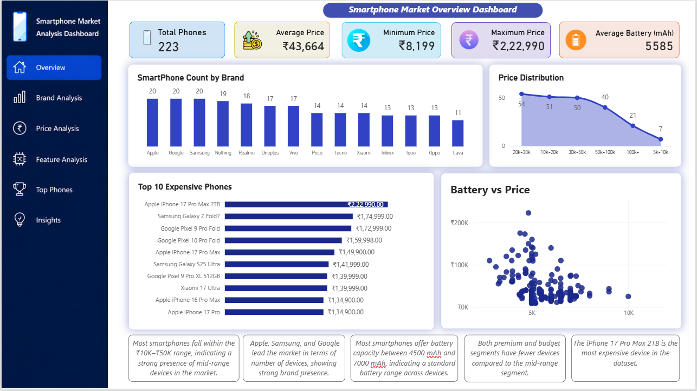
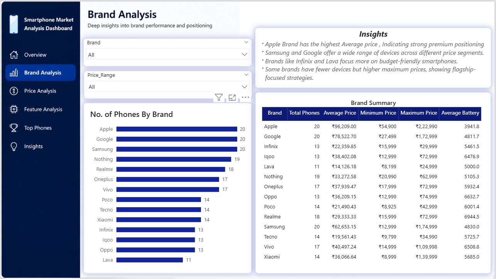
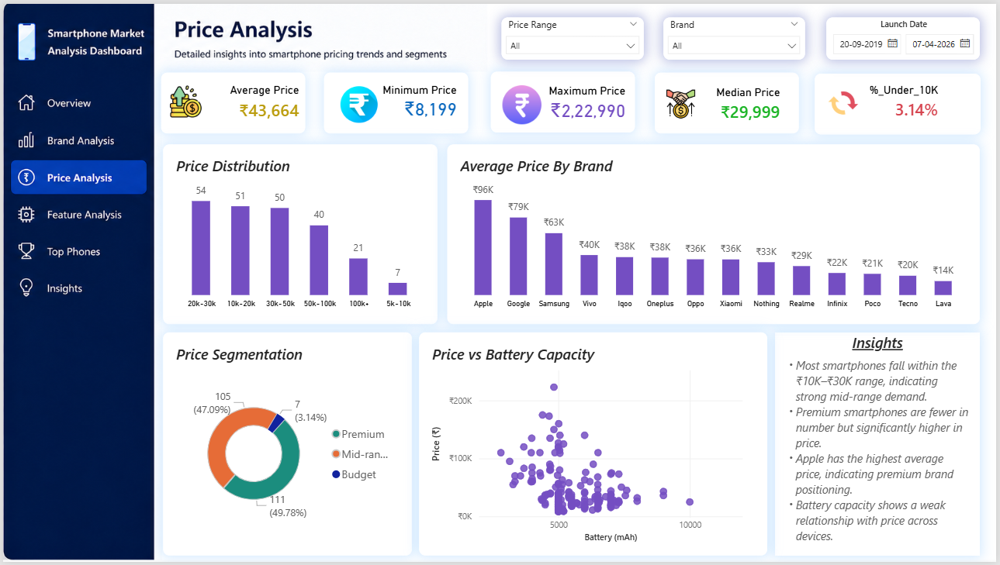
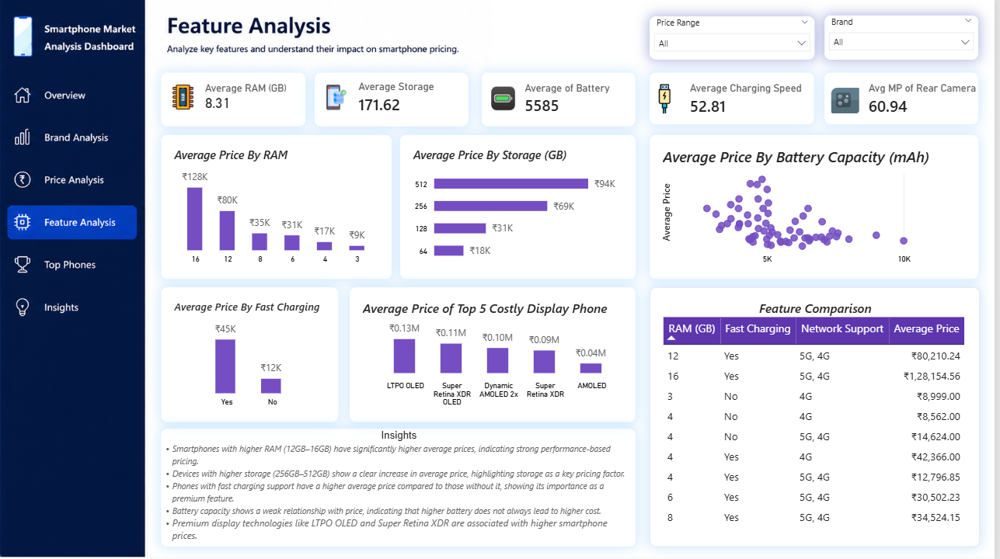
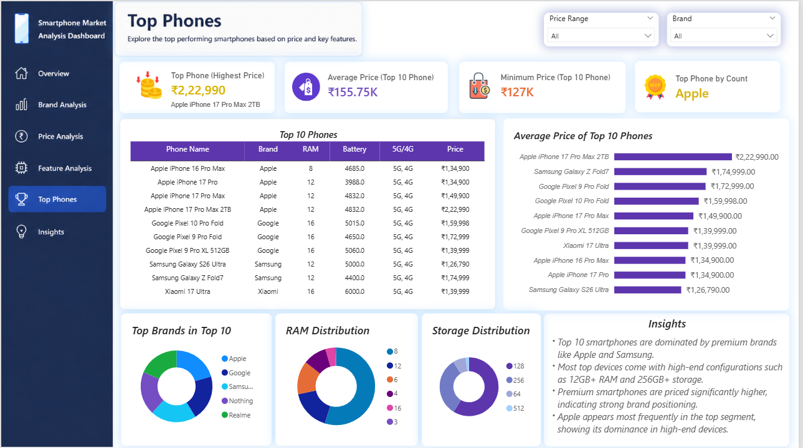
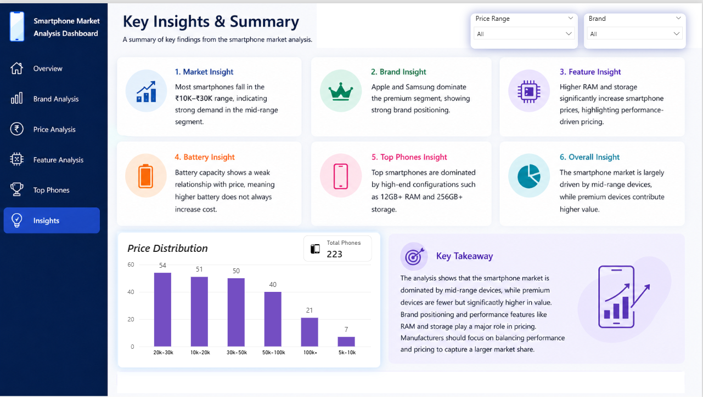

#Smartphone-Market-Analysis
# 📊 Smartphone Market Analysis (End-to-End Project)

This project presents a complete data analysis pipeline using SQL, Python (Pandas), and Power BI.

---

## 🚀 Tools Used
- SQL (Data Querying)
- Python (Pandas for Data Cleaning & Analysis)
- Power BI (Dashboard & Visualization)
- Excel/CSV (Dataset)

---

## 📂 Project Workflow
1. Data Cleaning using Python (Pandas)
2. Data Analysis using SQL queries
3. Visualization using Power BI Dashboard
4. Insights & Business Understanding

---

## 📊 Key Insights
- Most smartphones fall in the ₹10K–₹30K range
- Apple & Samsung dominate premium segment
- Higher RAM & storage increase price
- Battery has weak impact on pricing

## 📸 Dashboard Preview

### Overview

### Brand Analysis

### Price Analysis

### Feature Analysis

### Top Phones

### Insights

